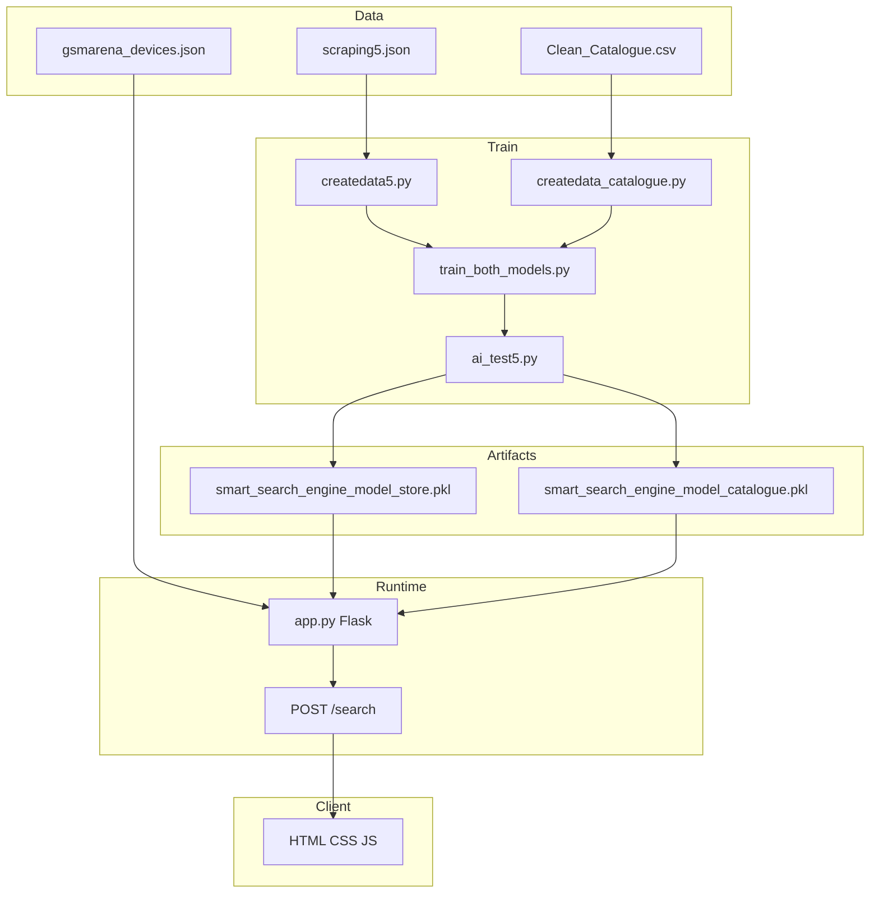

# Smart Search Engine - Products

**French / English:** ML-powered product search merging **boutique** (retail JSON) and **catalogue** (CSV specs) with **GSMArena** deep-link resolution.

[](https://www.python.org/)
[](https://flask.palletsprojects.com/)
[](https://scikit-learn.org/)

---

## Table of contents

1. [Overview](#overview)
2. [Features](#features)
3. [Architecture](#architecture)
4. [Repository layout](#repository-layout)
5. [Data and training pipeline](#data-and-training-pipeline)
6. [GSMArena integration](#gsmarena-integration)
7. [User interfaces](#user-interfaces)
8. [HTTP API](#http-api)
9. [Installation](#installation)
10. [Usage](#usage)
11. [Deployment](#deployment)
12. [Configuration](#configuration)
13. [Synonym map](#synonym-map)
14. [Troubleshooting](#troubleshooting)
15. [Legal and ethics](#legal-and-ethics)

---

## Overview

This repository implements a **lightweight semantic search engine** for telecom hardware and accessories: smartphones, tablets, modems/routers, audio and charging accessories, and related categories. It combines:

- A **boutique** index built from scraped JSON (`scraping5.json`) with prices in DA and product images.
- A **catalogue** index from a wide CSV (`Clean_Catalogue.csv`) with rich metadata and reference images.
- A local **GSMArena device index** (`gsmarena_devices.json`) to map product names, brands, and image URLs to **canonical spec pages**.
- A **Flask** web UI (HTML/CSS/JS) and an optional **Tkinter** desktop demo.

The ranking core uses **scikit-learn**: **TF-IDF** (word n-grams 1–3) and **SGDClassifier** with logistic loss, trained on synthetic pairs **(simulated user query | product text)** with binary **relevance** labels.

### French summary (résumé)

**Smart Search Engine** est un projet de **recherche produit** pour le matériel télécom (smartphones, tablettes, box 4G/Wi‑Fi, accessoires). Deux jeux de données alimentent deux modèles : la **boutique** (JSON type offre Djezzy avec prix en DA) et le **catalogue** (CSV riche). Au moment de l’affichage, les fiches **catalogue** peuvent être reliées à **GSMArena** (fiche technique) via un index local et des heuristiques sur les URLs d’images. L’interface web est en français ; le code et cette documentation sont en anglais pour faciliter la maintenance.

---

## Features

| Area | Details |
|------|---------|
| Hybrid search | Merges scores from two pickle models (boutique + catalogue), sorted by score, capped globally. |
| Query understanding | Synonym expansion (French slang: *jawl*, *kitman*, *tab*, etc.) aligned with training preprocessing. |
| Typo robustness | Training data uses random edits (delete/swap/duplicate characters) to mimic fast mobile typing. |
| Catalogue links | Resolves GSMArena picture URLs to spec pages; fuzzy match by brand and tokens; falls back to Bing `site:gsmarena.com` search. |
| Images | `scraping5.json` backfills images when a row has no usable `image_url`. |
| Relevance threshold | Web inference defaults to **0.35** (displayed as a 0–100 match percent). |
| Production process | `Procfile` runs **Gunicorn** for PaaS-style hosting. |

---

## Architecture



---

## Repository layout

| Path | Purpose |
|------|---------|
| `app.py` | Flask app: load models, GSMArena index, `/` and `/search`, combined ranking. |
| `ai_test5.py` | `SmartSearchEngine`: train, save pickle, CLI search demo. |
| `train_both_models.py` | Builds catalogue training CSV then trains both models. |
| `createdata5.py` | Builds `dataset_train5.csv` from `scraping5.json`. |
| `createdata_catalogue.py` | Builds `dataset_catalogue_train.csv` from `Clean_Catalogue.csv`. |
| `gsmarena_crawl.py` | Crawl/parse GSMArena brand pages; slug index; fuzzy `resolve_url_for_product`. |
| `gsmarena_resolve.py` | Map GSMArena *pictures* URLs to spec URLs. |
| `build_gsmarena_index.py` | CLI to refresh `gsmarena_devices.json` (`--brand`, `--delay`). |
| `tkinter_interface5.py` | Desktop UI; loads **boutique** pickle only. |
| `classifierrr.py` | **Separate** task: predict **category** with TF-IDF + LinearSVC on `dataset_train5.csv` (not the main search ranker). |
| `templates/index.html` | Main page: hero, search, quick chips, results grid. |
| `static/styles.css` | Theme: primary blue, Cairo + Open Sans, responsive grid. |
| `static/script.js` | `fetch('/search')`, product cards, source badges. |
| `requirements.txt` | `Flask`, `pandas`, `scikit-learn`, `gunicorn`, `requests`. |
| `Procfile` | `web: gunicorn app:app` |
| `scraping5.json` | Boutique scrape: brand title, model description, price, image URL. |
| `dataset_train5.csv` | Boutique training pairs (queries + relevance). |
| `Clean_Catalogue.csv` | Large inventory (DZD prices, specs, photo links). |
| `dataset_catalogue_train.csv` | Generated catalogue training set (includes `product_url`, `image_url`). |
| `gsmarena_devices.json` | Large pre-built GSMArena slug/brand index. |
| `results_training5.txt` | Sample console demo log (historical filename reference). |

**Note:** `smart_search_engine_model_store.pkl` and `smart_search_engine_model_catalogue.pkl` are **outputs** of training. If they are not committed, run the training scripts before `app.py`.

---

## Data and training pipeline

### Boutique (`createdata5.py`)

1. Load `scraping5.json`.
2. Deduplicate by normalized name key.
3. Assign **category** via keyword rules (`Smartphone`, `Routeur_Modem`, `Tablette`, `Accessoire_Audio`, etc.).
4. For each product, generate short **positive** queries from brand/model/category keywords; apply `mess_up_text` typos.
5. Sample **negative** queries from other products' keywords.
6. **Boost** sampling for tablets and modems; medium boost for smartphones.
7. Write `dataset_train5.csv` with columns: `product_id`, `product_name`, `category`, `description`, `price`, `user_query`, `relevance_label`.

**`scraping5.json` record shape:** `title` (brand), `description` (model), `price` (may contain `&nbsp;`), `image` (URL).

### Catalogue (`createdata_catalogue.py`)

1. Load `Clean_Catalogue.csv` with tolerant parsing.
2. **Resolve columns** by French headers (`Marque`, `Nom de modèle`, `Price_DZD`, `Lien Référence`, `Liens photos`, etc.).
3. Build display name, normalized category, description snippet from OS, RAM, storage, chipset, cellular tech.
4. Set `product_url` to GSMArena **search** URL (`res.php3?sSearch=...`); `app.py` upgrades this to a **spec** URL when possible.
5. Same positive/negative/typo strategy with category-specific boosts.

**`Clean_Catalogue.csv`:** very wide table; key columns are resolved at runtime by substring matching on header names (see `resolve_columns` in `createdata_catalogue.py`).

### Training (`ai_test5.py`)

- **Feature string:** `preprocess_query(user_query) + " | " + product_name + category + description + price` (as assembled in code).
- **Pipeline:** `TfidfVectorizer(ngram_range=(1,3))` then `SGDClassifier(loss='log_loss', ...)`.
- **Pickle bundle:** `pipeline`, `database` (unique `product_id` rows with `search_text` and `source`), metadata `source`.

`train_both_models.py` runs: `create_catalogue_dataset()` then trains and saves both pickle files.

### How inference matches training (`app.py`)

The web app's `SmartSearchEngine.search` builds `candidate_features` as `clean_query + " | " + candidates['search_text']`, where `search_text` was precomputed at train time from name, category, description, and price. **Keep synonym dictionaries identical** across `app.py`, `ai_test5.py`, and `tkinter_interface5.py`.

---

## GSMArena integration

### Index file

`gsmarena_devices.json` holds `slug_index`, `by_brand`, and `brand_pages`. Loaded at Flask startup (`gsmarena_crawl.load_index`).

### Refreshing the index (optional)

```bash
python build_gsmarena_index.py --delay 0.35 --out gsmarena_devices.json
python build_gsmarena_index.py --brand samsung --brand xiaomi
```

Use a polite `--delay`; respect GSMArena terms of use. Production can rely on the committed JSON to avoid crawling.

### Link resolution order in `app.py` (`_catalogue_gsmarena_url`)

1. `pictures_url_to_spec_url(image_url)` if the image host is GSMArena.
2. `resolve_url_for_product(...)` using slug from image filename, then token scoring within the brand list.
3. Stored `product_url` if it already matches a direct `gsmarena.com/...php` spec pattern (excluding `res.php3`).
4. Else a **Bing** search URL: `site:gsmarena.com` + product name.

### Crawler behaviour (`gsmarena_crawl.py`)

- Uses a desktop Chrome-like `User-Agent` and `requests` session.
- Discovers brand listing URLs from the GSMArena home page, paginates with `prevnextbutton` “Next”.
- Extracts phone links with regex; builds a **base slug** (strip trailing numeric id segment).
- Retries with exponential backoff on network errors.

---

## User interfaces

### Web (Flask)

- Sticky navbar, gradient hero, rounded search field, quick suggestion chips.
- Responsive card grid: image, **Catalogue** / **Boutique** badge, category, title, AI match %, price, external button (spec or Bing fallback).
- Typography: **Cairo** (headings/logo), **Open Sans** (body); **Font Awesome** icons from CDN.

### Desktop (Tkinter)

`tkinter_interface5.py`: ~600x850 window, search entry, hardware quick chips, scrollable result cards with a match progress bar. Uses threshold **0.35**. Loads only `smart_search_engine_model_store.pkl`.

---

## HTTP API

### `GET /`

Serves `templates/index.html`.

### `POST /search`

- **Body:** JSON `{"query": "user text"}`
- **Response:** JSON array of objects, fields include:

| Field | Meaning |
|-------|---------|
| `product_id` | String id |
| `name` | Product name |
| `price` | Formatted price |
| `category` | Category label |
| `description` | Short text |
| `score` | Integer 0–100 |
| `image` | Image URL |
| `url` | Outbound link |
| `source` | `boutique` or `catalogue` |
| `source_label` | Display label |

`combined_search` in `app.py` takes up to **22** hits per engine and returns at most **45** after merge sort.

---

## Installation

**Requirements:** Python 3.10+ recommended (type hints in GSMArena modules).

```bash
python -m venv .venv
# Windows
.venv\Scripts\activate
pip install -r requirements.txt
```

For `classifierrr.py` plots, also install `matplotlib` and `seaborn`.

---

## Usage

### Train both models (recommended once data is ready)

```bash
python train_both_models.py
```

### Train boutique only

```bash
python ai_test5.py
```

### Regenerate training CSVs only

```bash
python createdata5.py
python createdata_catalogue.py
```

### Run web app

```bash
python app.py
```

Open **http://127.0.0.1:5000/** .

### Run Tkinter demo

```bash
python tkinter_interface5.py
```

### Category classifier (separate experiment)

```bash
pip install matplotlib seaborn
python classifierrr.py
```

Writes `confusion_matrix.png` and prints classification metrics by **category**.

---

## Deployment

`Procfile`:

```
web: gunicorn app:app
```

Ship the app root with `templates/`, `static/`, `requirements.txt`, `Procfile`, and runtime data: **`smart_search_engine_model_*.pkl`**, **`gsmarena_devices.json`**, **`scraping5.json`**, and any CSV/JSON the app reads. Ensure the working directory is the project root so relative paths in `app.py` resolve.

---

## Configuration

| Setting | Location | Default / notes |
|---------|----------|------------------|
| Score threshold | `app.py` `search(..., score_threshold=0.35)` | 0.35 |
| Per-engine top-k | `combined_search(top_k_each=22)` | 22 |
| Merged cap | `max_total=45` | 45 |
| Boutique dataset size target | `createdata5.py` `TARGET_DATASET_SIZE` | 3500 |
| Catalogue dataset size target | `createdata_catalogue.py` `TARGET_DATASET_SIZE` | 14000 |
| Synonyms | `app.py`, `ai_test5.py`, `tkinter_interface5.py` | Keep in sync across files |
| JSON image map | `app.py` `JSON_FILE` | `scraping5.json` |
| Model filenames | `app.py` | `smart_search_engine_model_store.pkl`, `smart_search_engine_model_catalogue.pkl` |

---

## Synonym map

These tokens are **expanded at query time** (original word kept, synonym appended). Same logical map appears in `app.py`, `ai_test5.py`, and `tkinter_interface5.py`.

| User token | Expanded to |
|------------|-------------|
| telephone, mobile, portable, jawl, hètf, tel, cellulaire | smartphone |
| kitman, ecouteur, casque, airpods, earbuds | ecouteurs |
| chargeur, cable, fil, usb, powerbank | accessoire |
| wifi, routeur, box, 4g | modem |
| tab, ipad | tablette |

---

## Troubleshooting

| Issue | What to check |
|-------|----------------|
| No results | Missing `.pkl` files; console messages at startup. |
| Low scores | Retrain with more positives for that semantic area; or lower threshold (with care). |
| Wrong GSMArena links | Refresh `gsmarena_devices.json`; check `image_url` quality for slug extraction. |
| Broken images | Remote host blocking hotlinking; verify `scraping5.json` keys vs product names. |
| Import errors | Run from directory containing `app.py` so `gsmarena_*` modules resolve. |
| Crawl failures | Rate limits or blocking; increase delay or use bundled JSON. |

---

## Legal and ethics

- Third-party data (prices, images, specs) may be subject to copyright and terms of use; this project is suitable for **learning and demos** unless you have rights for production.
- Web scraping must follow site policies and reasonable request rates; prefer shipping a **static index** for GSMArena in production.
- Bing fallback links are used when automatic spec resolution fails; users leave your app to a third-party search engine.

---

<div align="center">

**Smart Search Engine - Products**  
*Intelligent multi-source hardware search with GSMArena deep linking.*

</div>

---

## Implementation reference (source files)

| Concern | Where it lives |
|---------|----------------|
| Flask routes, dual engines, synonym preprocessing | `app.py` |
| Training pipeline, pickle format, feature construction | `ai_test5.py` |
| One-shot train boutique + catalogue | `train_both_models.py` |
| Synthetic boutique dataset from JSON | `createdata5.py` |
| Synthetic catalogue dataset from `Clean_Catalogue.csv` | `createdata_catalogue.py` |
| GSMArena crawl, slug index, URL resolution | `gsmarena_crawl.py`, `gsmarena_resolve.py` |
| CLI to rebuild device JSON | `build_gsmarena_index.py` |
| Category-only classifier (TF-IDF + LinearSVC) | `classifierrr.py` |
| Desktop demo (boutique model) | `tkinter_interface5.py` |
| Front-end | `templates/index.html`, `static/styles.css`, `static/script.js` |

## Front-end behaviour (`static/script.js`)

- POST JSON to `/search` with a body like `{"query": "modem wifi"}`.
- Renders each hit as a card with `source-badge` (catalogue vs boutique).
- External links: if the URL points to Bing search, the button label is *Ouvrir la recherche GSMArena*; otherwise *Fiche GSMArena*.
- Broken images fall back to a placeholder URL.

## Model artifacts

After training, expect:

- `smart_search_engine_model_store.pkl` - boutique products and ranker.
- `smart_search_engine_model_catalogue.pkl` - catalogue rows (with URLs and images) and ranker.

Each file is a pickled dict with keys such as `pipeline`, `database`, and `source`.

## Related: `classifierrr.py` vs search

`classifierrr.py` trains a **multiclass category classifier** (`category` from text), exports `confusion_matrix.png`, and is **not** used by `app.py` for ranking. The live search stack uses **binary relevance** models defined in `ai_test5.py` and stored in the pickle bundles.

## Credits and context

Sample retail data in `scraping5.json` references `djezzy.dz` image URLs; the catalogue CSV is a wide operational export. This README documents the repository layout and the training and deployment scripts shipped in the project.
